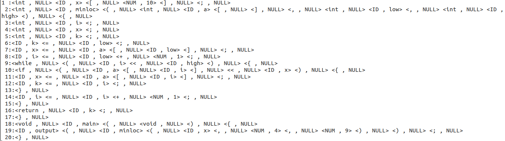
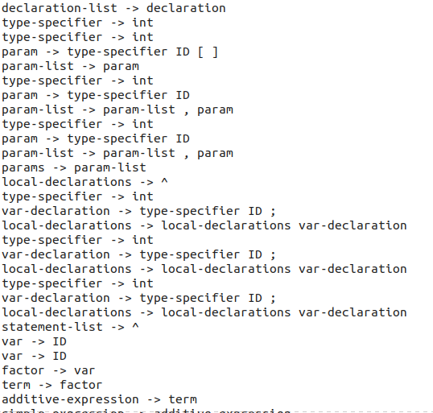
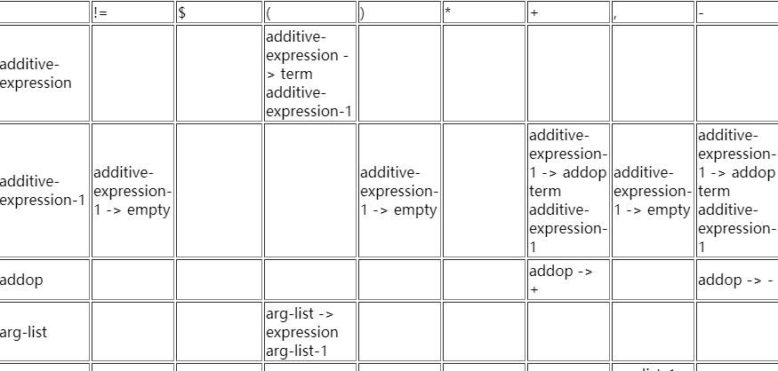
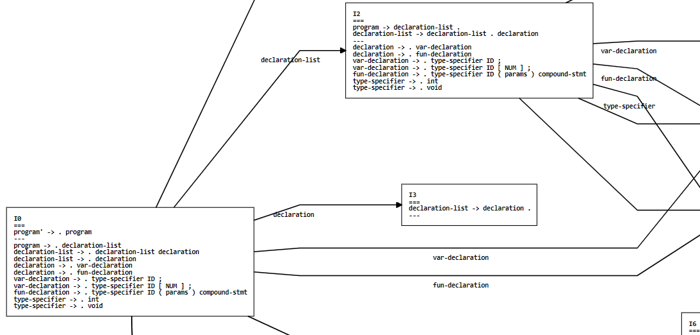
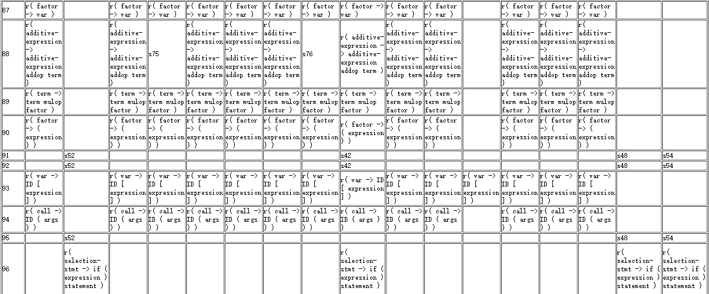
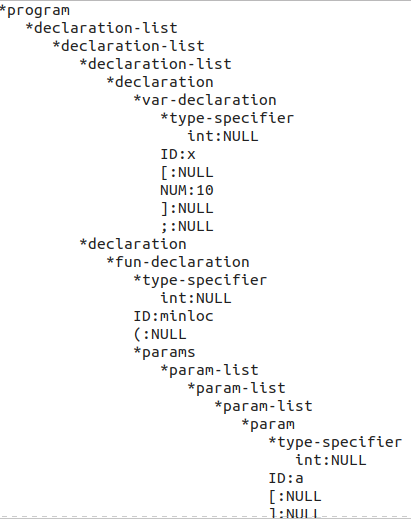
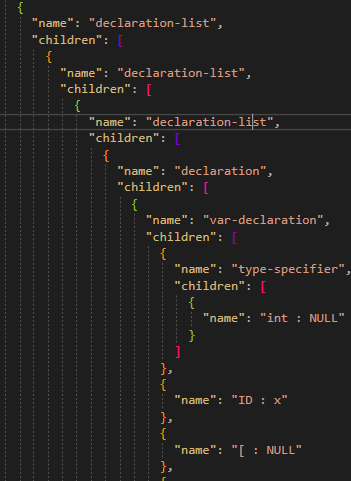
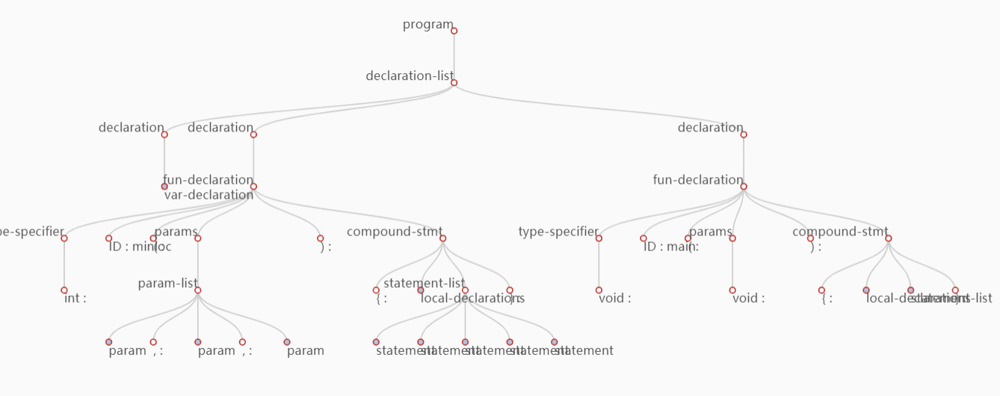

**本次实验实现了一个简易的C_Minus编译器的部分功能（词法分析，语法分析）
词法分析使用了lex和手写两种方式分别实现
语法分析使用了递归下降，LL(1),SLR(1),yacc四种方式分别实现
部分实验结果如下(全部实验结果请参照实验报告及相应的文件)：**
&nbsp;

 <h6>语法分析输出结果</h6> 

&nbsp;

 <h6>使用的生成式列表</h6> 

&nbsp;

 <h6>部分LL(1)分析表</h6> 

&nbsp;

 <h6>部分LR(0)自动机</h6> 

&nbsp;

 <h6>部分SLR(1)分析表</h6> 

&nbsp;

 <h6>部分LL1分析表</h6> 

**三种树输出格式如下:**
&nbsp;

 <h6>缩进格式输出的语法分析树</h6> 

&nbsp;

 <h6>json格式输出的语法分析树</h6> 

&nbsp;

 <h6>echarts绘制的语法分析树</h6> 

**设计思路和方法详见编译原理课程设计报告：**

